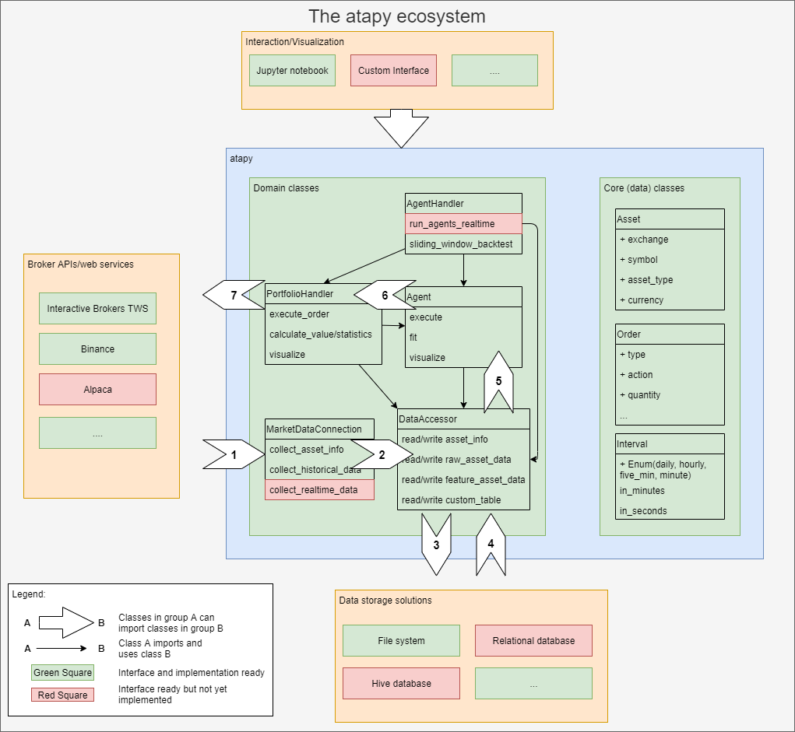

# atapy
*Asset trader agents - A module for software agents trading assets*

 
## Summary
Atapy is a Python library for speculation-trading of assets, built with machine 
learning in focus. The library facilitates collection of asset (price) data from brokers, storing asset data, 
providing such data for analyses, as well as an environment for easy implementation of agents that 
buy and sell the assets. The environment includes both training the agents on existing data, backtesting 
the agents on existing data, as well a realtime environment where they directly can interact with brokers
of the assets. 

The core of the library is a few interface-classes, for which the users themselves can provide 
implementations to their broker/agent/data storage system. This allows for a modularized setup where 
parts can be reused between asset types and agents etc. Note however that this also means that the library is 
not plug and play and production ready, but for developers willing to do their own implementations and
adjustments for their data. 
  
Finally, atapy is built with performance in focus to allow training and backtesting of agents. 
These tasks can run both vectorized and in parallel, allowing a speedup by a factor of 100 compared to 
traditional libraries such as zipline.

## Introduction and Motivation

Today there exist several Python libraries and platforms for trading various assets such as stocks or 
currencies. Some of the most famous are Quantopian (with Zipline) and Backtrader for libraries and Trality
on the platform side (providing their own libraries). The focus of these have however been to create various 
trading strategies by hand, such as MA crossover for example, and then evaluate these on existing data 
(aka backtesting). The backtesting loop is traditionally implemented as chronological repeated calls 
to a "decision-function", where the agent performs the decision on what action to take, with one call for each 
sample of data. This works ok-ish for 'light' (non-neural network) models, over limited time-periods, for some 
assets, but not in a machine learning setup, where thousands of models should be evaluated over thousands of 
assets over years. Moreover, the design also often uses custom formats, making it difficult for experienced 
data scientists to use the tools they are used to (aka Pandas and SciPy) to analyze the data.

Ergo, atapy (Asset Trader Agents in Python) was created to solve these issues, and more specifically facilitate 
the following objectives:
* Collect asset data from various data sources and APIs
* Efficiently load the data for offline analysis
* Create software agents with a 'training' phase and an 'execution' phase and test these on existing data
* Run these agents 'live', trading with real assets at the brokers

## What is atapy

To facilitate the objectives above atapy was designed with a modularized setup in mind, where each part would be 
replaceable and adjustable depending on broker, agent or data storage. This would allow for most parts to be 
reusable between Brokers and assets, while allowing the flexibility missing in some of the other existing 
libraries. Hence, the core of the atapy is a set of interface classes, for which different implementations 
exist as described in the 'Module-ecosystem below'. Some implementations exist, but most likely not the 
broker/agent you as a user is interested in. This means that you will have to do the development yourself, but 
using the interface provided, your implementation will be able to reuse the other parts of the library. In other
words, this library is for developers understanding the code, not for users who just expect to use some top 
level methods.

That said, the library is built to do the following:
* Collect various types of asset data, both historical and live data
* Store this data in both its raw and its preprocessed form
* Provide the data to be loaded and visualized for analyses with additional indicators/features
* Provide an interface for agent implementation, with both visualization and performance metrics
* Provide portfolio handling, both artificial for backtesting, but also live that interacts with the asset 
brokers

## Module Ecosystem
As described above the atapy consists of a few domain classes interfaces as well as a few core
data classes. These are shown in the fig below:

Each of the classes MarketDataConnection, DataAccessor, Agent and PortfolioHandler have 
multiple implementations depending on usage, with some methods shared among them. 

To get a full description of the classes, please read the doc in the appropriate file, but in
short the responsibilities classes are the following: 
* DataAccessor: Store and load the data efficiently as well as to virtually limiting access by
hiding the data (used for example during training). 
Note that the structure of the (pandas) tables that are to be read and stored are hard set, 
with a possibility of storing additional info in custom tables. 
* MarketDataCollection: Interacts and collects data from the broker API/Data source to
download available data (historically and real time). Also preprocesses the data to the set
feature format (see design decisions).
* Agent: Executes the trading strategy, possibly fitting itself on some given data. Also 
visualizes the inner state of the agent together with decisions etc.
* PortfolioHandler: Takes orders (provided by the agents during execution) and executes them. 
Either virtually in a backtesting scenario, or forwards them towards the broker API. 

This means the data/decision flow in large looks as follows:  

## Design decisions and data formats
For this library several design decisions have been taken. Most of them have been made to keep
the library as open as possible. This to be able to fulfill any need by the user, with the 
downside that the user will have to keep track of what is going on to not accidentally invoke
incorrect behaviour. The large exception from this philosophy is however the data formats, 
and the data types. There three 'types' of data:
* asset_info: Columns: 'asset_type', 'exchange', 'symbol', 'currency', 'full_name', 'industry', 
'category', 'subcategory', 'liquid_hours', 'time_zone'
* raw_data: 'date', 'open', 'high', 'low', 'close', 'volume', 'average', 'nr_of_trades'
* feature_data: 'open', 'high', 'low', 'close', 'volume', 'average', 'nr_of_trades', 
'start_time', 'end_time', 'real_sample'

These are further described in the data_accessor file, but the structure is chosen to be hard 
set to these columns to allow reusability of the different classes better.

Another design decision is to always store the data in UTC time formats. However, with 
options in the readers (automatically transferring the datetimes back to the exchange 
timezone) this becomes more or less hidden to the user.

## Implementations
So far only a handful of implementations of the interface classes have been made. These are:
* MarketDataConnection: 
  * Interactive Brokers: Connects to the TWS and downloads data through the API using the 
  ib_insync interface library. Rather slow and inefficient API, but with a huge selection of 
  assets and exchanges.
  * Binance API: Very straightforward implementation. 
* DataAccessor:
  * FileAccessor: Saves the data on the file_system, with one file per table. Not the most
  beautiful solution, but easy to debug and works really well performance-wise.
* Agent:
  * A few implementations exist with well known strategies such as 'buy_and_hold', 
  'ma_crossover', 'macd_crossover' etc.
* PortfolioHandler:
  * Currently only the backtester is implemented. However, with both Interactive Brokers and 
  Binance supporting orders, such implementation should be straightforward, once required
 
## Under development - Contributions
The library is still very much under development and can change considerably during refactorings. 
So far it is only used by one developer, and constantly updated to fulfill any new needs.
However, so far the structure very much satisfies any use-case that has come up.

If you interested in using it, please contact Dag Sonntag (dag@sonntag.se) and we 
can discuss how to cooperate in the best way possible!